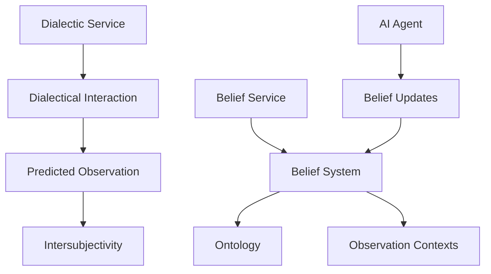

## Dialectic Model Architecture

The dialectic system in Epistemic Me is designed to facilitate the interaction between AI agents and belief systems through a structured dialogue process. Here's a detailed breakdown of the architecture:

<Frame>
  
</Frame>

### Core Components

#### Service Layers
- **Belief Service**: Manages belief operations and persistence
- **Dialectic Service**: Handles dialectic interactions and processing
- **Helper Service**: Provides utility functions and shared operations

#### AI Agent Integration
The system integrates with AI agents through several key components:
- **Proto Model**: Defines base interaction protocols
- **Service**: Handles request/response patterns
- **AI Agent**: Processes dialectic interactions and belief updates

### Belief System Components

The belief system consists of several interconnected parts:

1. **Belief System**
   - Manages belief states and relationships
   - Handles belief context tracking
   - Processes belief updates

2. **Ontology**
   - Defines relationships between beliefs
   - Maintains belief hierarchies
   - Tracks belief context mappings

3. **Observation Contexts**
   - Manages contextual frameworks
   - Tracks observation patterns
   - Links beliefs to observable phenomena

### Dialectic Flow

The dialectic process follows a structured flow:

1. **Dialectical Interaction**
   - Initiates with user or system input
   - Processes through belief validation
   - Generates appropriate responses

2. **Predicted Observation**
   - Uses belief system to generate predictions
   - Compares against actual observations
   - Updates belief system based on discrepancies

3. **Intersubjectivity**
   - Manages shared understanding between agents
   - Processes belief conflicts and resolutions
   - Updates shared context models

### Implementation Details



### Key Processes

1. **Belief Update Cycle**
   - `GenerateBeliefSystem`: Creates initial belief structures
   - `UpdateBeliefSystem`: Processes belief modifications
   - `GeneratePredictions`: Creates observation-based predictions

2. **Dialectic Processing**
   - `InitiateDialectic`: Starts new dialectic sessions
   - `ProcessInteraction`: Handles ongoing dialectic flows
   - `UpdateBeliefs`: Modifies beliefs based on interactions

3. **Observation Handling**
   - `GenerateObservation`: Creates new observations
   - `CompareObservation`: Validates against predictions
   - `UpdateContext`: Modifies observation contexts

## Integration Points

The system provides several integration points for developers:

1. **Service Methods**
```go
type DialecticService interface {
    InitiateDialectic(context.Context, *proto.InitiateRequest) (*proto.InitiateResponse, error)
    ProcessInteraction(context.Context, *proto.InteractionRequest) (*proto.InteractionResponse, error)
    UpdateBeliefs(context.Context, *proto.UpdateRequest) (*proto.UpdateResponse, error)
}
```

2. **AI Agent Integration**
```python
class AIAgent:
    def process_dialectic(self, interaction: DialecticInteraction) -> Response:
        # Process dialectic interaction
        pass

    def update_beliefs(self, observation: Observation) -> BeliefUpdate:
        # Update beliefs based on observation
        pass
```

## Best Practices

When implementing the dialectic model:

1. **Belief System Management**
   - Maintain atomic belief updates
   - Track belief provenance
   - Handle belief conflicts gracefully

2. **Dialectic Processing**
   - Implement proper error handling
   - Maintain interaction context
   - Track belief update history

3. **Observation Handling**
   - Validate observations against predictions
   - Track observation context changes
   - Handle observation conflicts

## Related Concepts

- [Belief Systems](/docs/concepts/belief-system)
- [Observation Contexts](/docs/concepts/observation-contexts)
- [Philosophy Integration](/docs/concepts/philosophy) 